<div align="center">
  
  
  # RustAPI
  
  **The power of Rust. Modern DX. LLM-ready.**

  [](https://crates.io/crates/rustapi-rs)
  [](https://docs.rs/rustapi-rs)
  [](LICENSE)
  [](https://crates.io/crates/rustapi-rs)
  [](https://github.com/Tuntii/RustAPI/actions)
  [](https://github.com/Tuntii/RustAPI/stargazers)
  
  
  
  
  <a href="https://www.producthunt.com/products/rustapi?embed=true&utm_source=badge-featured&utm_medium=badge&utm_campaign=badge-rustapi" target="_blank"></a>
</div>

---

## Vision

RustAPI redefines **API development for the AI era**.

We combine Rust's performance and safety with FastAPI's ergonomics. Write type-safe, production-ready APIs without fighting trait bounds. **MCP servers**, **LLM integrations**, or classic REST APIs — one framework for all.

---

## Philosophy

> *"API surface is ours, engines can change."*

RustAPI follows a **Facade Architecture** — a stable, ergonomic public API that shields you from internal complexity and breaking changes.

### Core Principles

| Principle | What It Means |
|-----------|---------------|
| **🎯 5-Line APIs** | A working REST endpoint in 5 lines. No ceremony. |
| **🛡️ Stable Surface** | Your code depends on `rustapi-rs`. Internal crates (`hyper`, `tokio`, `validator`) are implementation details. |
| **🔄 Engines Change** | We can swap `hyper` for `h3`, upgrade `tokio`, or replace `validator` — your code stays the same. |
| **🎁 Batteries Included** | JWT, CORS, Rate Limiting, OpenAPI — all built-in, all optional via feature flags. |
| **🤖 LLM-First** | TOON format, token counting headers, MCP-ready. Built for the AI era. |

### Why This Matters

```
┌─────────────────────────────────────────────────────────────┐
│                    Your Application                          │
│                   use rustapi_rs::prelude::*                 │
├─────────────────────────────────────────────────────────────┤
│                     rustapi-rs (Facade)                      │
│              Stable API ── Never Breaks                      │
├───────────────┬───────────────┬───────────────┬─────────────┤
│ rustapi-core  │ rustapi-toon  │ rustapi-extras│ ...         │
│   (hyper)     │   (serde)     │    (jwt)      │             │
├───────────────┴───────────────┴───────────────┴─────────────┤
│              Foundation: tokio, serde, hyper                 │
│              ↑ Can be upgraded/swapped internally            │
└─────────────────────────────────────────────────────────────┘
```

**Internal upgrades don't break your code.** When `hyper 2.0` releases, we update `rustapi-core`. Your `RustApi::new()` keeps working.

📚 Read more: [docs/PHILOSOPHY.md](docs/PHILOSOPHY.md) | [docs/ARCHITECTURE.md](docs/ARCHITECTURE.md)

```rust
use rustapi_rs::prelude::*;

#[rustapi_rs::get("/hello/{name}")]
async fn hello(Path(name): Path<String>) -> Json<Message> {
    Json(Message { greeting: format!("Hello, {name}!") })
}

#[tokio::main]
async fn main() -> Result<(), Box<dyn std::error::Error + Send + Sync>> {
    RustApi::auto().run("0.0.0.0:8080").await
}
```

5 lines of code. Auto-generated OpenAPI docs. Production-ready.

---

## 🚀 Performance

RustAPI is **blazingly fast** — built on Tokio and Hyper 1.0, with zero-cost abstractions.

### Benchmarks

| Framework | Requests/sec | Latency (avg) | Memory |
|-----------|--------------|---------------|--------|
| **RustAPI** | **~185,000** | **~0.54ms** | **~8MB** |
| **RustAPI + simd-json** | **~220,000** | **~0.45ms** | **~8MB** |
| Actix-web | ~178,000 | ~0.56ms | ~10MB |
| Axum | ~165,000 | ~0.61ms | ~12MB |
| Rocket | ~95,000 | ~1.05ms | ~15MB |
| FastAPI (Python) | ~12,000 | ~8.3ms | ~45MB |

<details>
<summary>🔬 Test Configuration</summary>

- **Hardware**: Intel i7-12700K, 32GB RAM
- **Method**: `wrk -t12 -c400 -d30s http://127.0.0.1:8080/api/users`
- **Scenario**: JSON serialization of 100 user objects
- **Build**: `cargo build --release`

Results may vary based on hardware and workload. Run your own benchmarks:
```bash
cd benches
./run_benchmarks.ps1
```
</details>

### Why So Fast?

| Optimization | Description |
|--------------|-------------|
| ⚡ **SIMD-JSON** | 2-4x faster JSON parsing with `simd-json` feature |
| 🔄 **Zero-copy parsing** | Direct memory access for path/query params |
| 📦 **SmallVec PathParams** | Stack-optimized path parameters |
| 🎯 **Compile-time dispatch** | All extractors resolved at compile time |
| 🌊 **Streaming bodies** | Handle large uploads without memory bloat |

---

## Quick Start

### Installation

```toml
[dependencies]
rustapi-rs = "0.1.9"
```

Or with all features:

```toml
[dependencies]
rustapi-rs = { version = "0.1.9", features = ["full"] }
```

```rust
use rustapi_rs::prelude::*;

#[derive(Serialize, Schema)]
struct User { id: u64, name: String }

#[rustapi_rs::get("/users/{id}")]
async fn get_user(Path(id): Path<u64>) -> Json<User> {
    Json(User { id, name: "Tunahan".into() })
}

#[tokio::main]
async fn main() -> Result<(), Box<dyn std::error::Error + Send + Sync>> {
    // Zero config: all `#[rustapi_rs::get/post/..]` routes are auto-registered.
    // Swagger UI is enabled at /docs by default (when built with the `swagger-ui` feature).
    RustApi::auto().run("127.0.0.1:8080").await
}
```

`http://localhost:8080/docs` → Swagger UI ready.

---

## ✨ Features

### Core Features

| Feature | Description |
|---------|-------------|
| **Type-Safe Extractors** | `Json<T>`, `Query<T>`, `Path<T>`, `WebSocket` — compile-time guarantees |
| **Zero-Config Routing** | Macro-decorated routes auto-register at startup (`RustApi::auto()`) |
| **Auto OpenAPI** | Your code = your docs. `/docs` endpoint out of the box |
| **Validation** | `#[validate(email)]` → automatic 422 responses |
| **JWT Auth** | One-line auth with `AuthUser<T>` extractor |
| **CORS & Rate Limit** | Production-ready middleware |
| **TOON Format** | **50-58% token savings** for LLMs |
| **WebSocket** | Real-time bidirectional communication with broadcast support |
| **Template Engine** | Server-side HTML rendering with Tera templates |
| **CLI Tool** | `cargo-rustapi` for project scaffolding |

### 🆕 New in 0.1.8

| Feature | Description |
|---------|-------------|
| **🚀 SIMD-JSON** | 2-4x faster JSON parsing with `simd-json` feature |
| **📦 Background Jobs** | `rustapi-jobs` crate with Redis/Postgres backends |
| **🧪 Testing Utils** | `rustapi-testing` crate for easy integration tests |
| **📋 Audit Logging** | GDPR/SOC2 compliance with audit trails |
| **🌊 Streaming Body** | Handle large uploads without memory bloat |
| **🔧 CLI Enhancements** | `watch`, `add`, `doctor` commands |

### Optional Features

```toml
rustapi-rs = { version = "0.1.9", features = ["jwt", "cors", "toon", "ws", "view"] }
```

| Feature | Description |
|---------|-------------|
| `jwt` | JWT authentication with `AuthUser<T>` extractor |
| `cors` | CORS middleware with builder pattern |
| `rate-limit` | IP-based rate limiting |
| `toon` | LLM-optimized TOON format responses |
| `ws` | WebSocket support with broadcast |
| `view` | Template engine (Tera) for SSR |
| `simd-json` | 2-4x faster JSON parsing |
| `audit` | GDPR/SOC2 audit logging |
| `full` | All features enabled |

---

## 📂 Examples

All examples are production-ready and follow best practices.

```bash
# Getting Started
cargo run -p hello-world         # 5-line hello world
cargo run -p crud-api            # Full CRUD with validation
cargo run -p proof-of-concept    # Feature showcase

# Authentication & Security
cargo run -p auth-api            # JWT authentication
cargo run -p rate-limit-demo     # Rate limiting patterns
cargo run -p middleware-chain    # Custom middleware

# Database & Storage
cargo run -p sqlx-crud           # PostgreSQL with SQLx

# AI & LLM Integration
cargo run -p toon-api            # TOON format for LLMs
cargo run -p mcp-server          # Model Context Protocol server

# Real-time & Web
cargo run -p websocket           # WebSocket chat
cargo run -p templates           # Server-side rendering

# Advanced Patterns (NEW!)
cargo run -p event-sourcing      # CQRS/Event Sourcing demo
cargo run -p microservices-advanced  # Multi-service with Docker
cargo run -p serverless-lambda   # AWS Lambda integration
cargo run -p microservices       # Service discovery
```

### 📚 Example Categories

<details>
<summary><b>🌟 Getting Started</b></summary>

- **[hello-world](examples/hello-world/)** — Minimal 5-line API
- **[crud-api](examples/crud-api/)** — Complete CRUD with in-memory storage
- **[proof-of-concept](examples/proof-of-concept/)** — Feature showcase

</details>

<details>
<summary><b>🔐 Authentication & Security</b></summary>

- **[auth-api](examples/auth-api/)** — JWT authentication & authorization
- **[rate-limit-demo](examples/rate-limit-demo/)** — IP-based rate limiting
- **[middleware-chain](examples/middleware-chain/)** — Custom auth middleware

</details>

<details>
<summary><b>🗄️ Database Integration</b></summary>

- **[sqlx-crud](examples/sqlx-crud/)** — PostgreSQL with SQLx

</details>

<details>
<summary><b>🤖 AI & LLM</b></summary>

- **[toon-api](examples/toon-api/)** — TOON format for token optimization
- **[mcp-server](examples/mcp-server/)** — Model Context Protocol integration

</details>

<details>
<summary><b>🌐 Real-time & Web</b></summary>

- **[websocket](examples/websocket/)** — WebSocket chat with broadcast
- **[templates](examples/templates/)** — Server-side HTML rendering

</details>

<details>
<summary><b>🏗️ Advanced Patterns</b></summary>

- **[event-sourcing](examples/event-sourcing/)** — CQRS/Event Sourcing demo 🆕
- **[microservices-advanced](examples/microservices-advanced/)** — Multi-service with Docker 🆕
- **[serverless-lambda](examples/serverless-lambda/)** — AWS Lambda integration 🆕
- **[microservices](examples/microservices/)** — Service discovery patterns

</details>

---

## 🔌 Real-time: WebSocket Support

RustAPI provides first-class WebSocket support for real-time applications.

```rust
use rustapi_rs::ws::{WebSocket, Message, Broadcast};

#[rustapi_rs::get("/ws")]
async fn websocket(ws: WebSocket) -> WebSocketUpgrade {
    ws.on_upgrade(handle_connection)
}

async fn handle_connection(mut stream: WebSocketStream) {
    while let Some(msg) = stream.recv().await {
        match msg {
            Message::Text(text) => {
                stream.send(Message::Text(format!("Echo: {}", text))).await.ok();
            }
            Message::Close(_) => break,
            _ => {}
        }
    }
}
```

**Features:**
- Full WebSocket protocol support (text, binary, ping/pong)
- `Broadcast` channel for pub/sub patterns
- Seamless integration with RustAPI routing

---

## 🎨 Template Engine

Server-side HTML rendering with Tera templates.

```rust
use rustapi_rs::view::{Templates, View, ContextBuilder};

#[rustapi_rs::get("/")]
async fn home(templates: Templates) -> View<()> {
    View::new(&templates, "index.html", ())
}

#[rustapi_rs::get("/users/{id}")]
async fn user_page(templates: Templates, Path(id): Path<u64>) -> View<User> {
    let user = get_user(id);
    View::with_context(&templates, "user.html", user, |ctx| {
        ctx.insert("title", &format!("User: {}", user.name));
    })
}
```

**Features:**
- Tera template engine (Jinja2-like syntax)
- Type-safe context with `ContextBuilder`
- Template inheritance support
- Auto-escape HTML by default

---

## 🤖 LLM-Optimized: TOON Format

RustAPI is built for **AI-powered APIs**.

**TOON** (Token-Oriented Object Notation) uses **50-58% fewer tokens** than JSON. Ideal for MCP servers, AI agents, and LLM integrations.

```rust
use rustapi_rs::toon::{Toon, LlmResponse, AcceptHeader};

// Direct TOON response
#[rustapi::get("/ai/users")]
async fn ai_users() -> Toon<UsersResponse> {
    Toon(get_users())
}

// Content negotiation: JSON or TOON based on Accept header
#[rustapi::get("/users")]
async fn users(accept: AcceptHeader) -> LlmResponse<UsersResponse> {
    LlmResponse::new(get_users(), accept.preferred)
}
// Headers: X-Token-Count-JSON, X-Token-Count-TOON, X-Token-Savings
```

**Why TOON?**
- Compatible with Claude, GPT-4, Gemini — all major LLMs
- Cut your token costs in half
- Optimized for MCP (Model Context Protocol) servers

---

## 🛠️ CLI Tool: cargo-rustapi

Scaffold, develop, and manage RustAPI projects with ease.

```bash
# Install the CLI
cargo install cargo-rustapi

# Create a new project
cargo rustapi new my-api
cargo rustapi new my-api --template full
cargo rustapi new my-api --interactive

# Development (NEW!)
cargo rustapi watch              # Auto-reload on file changes
cargo rustapi add cors jwt       # Add features to your project
cargo rustapi doctor             # Check environment health

# Code Generation
cargo rustapi generate handler users
cargo rustapi generate middleware auth
cargo rustapi docs               # Generate API documentation
```

**Available Templates:**

| Template | Description |
|----------|-------------|
| `minimal` | Basic "Hello World" setup |
| `api` | REST API with CRUD, validation, OpenAPI |
| `web` | Full web app with templates, WebSocket, static files |
| `full` | Everything included (JWT, CORS, rate-limit, DB) |

---

## Architecture

RustAPI follows a **Facade Architecture** — a stable public API that shields you from internal changes.

### System Overview

```mermaid
graph TB
    subgraph Client["🌐 Client Layer"]
        HTTP[HTTP Request]
        LLM[LLM/AI Agent]
        MCP[MCP Client]
    end

    subgraph Public["📦 rustapi-rs (Public Facade)"]
        direction TB
        Prelude[prelude::*]
        Macros["#[rustapi::get/post]<br>#[rustapi::main]"]
        Types[Json, Query, Path, Form]
    end

    subgraph Core["⚙️ rustapi-core (Engine)"]
        direction TB
        Router[Radix Router<br>matchit]
        Extract[Extractors<br>FromRequest trait]
        MW[Middleware Stack<br>Tower-like layers]
        Resp[Response Builder<br>IntoResponse trait]
    end

    subgraph Extensions["🔌 Extension Crates"]
        direction LR
        OpenAPI["rustapi-openapi<br>Swagger/Docs"]
        Validate["rustapi-validate<br>Request Validation"]
        Toon["rustapi-toon<br>LLM Optimization"]
        Extras["rustapi-extras<br>JWT/CORS/RateLimit"]
        WsCrate["rustapi-ws<br>WebSocket Support"]
        ViewCrate["rustapi-view<br>Template Engine"]
    end

    subgraph Foundation["🏗️ Foundation Layer"]
        direction LR
        Tokio[tokio<br>Async Runtime]
        Hyper[hyper 1.0<br>HTTP Protocol]
        Serde[serde<br>Serialization]
    end

    HTTP --> Public
    LLM --> Public
    MCP --> Public
    Public --> Core
    Core --> Extensions
    Extensions --> Foundation
    Core --> Foundation
```



### Request Flow


### Crate Dependency Graph


### Design Principles

| Principle | Implementation |
|-----------|----------------|
| **Single Entry Point** | `use rustapi_rs::prelude::*` imports everything you need |
| **Zero Boilerplate** | Macros generate routing, OpenAPI specs, and validation |
| **Compile-Time Safety** | Generic extractors catch type errors at compile time |
| **Opt-in Complexity** | Features like JWT, TOON are behind feature flags |
| **Engine Abstraction** | Internal hyper/tokio upgrades don't break your code |

### Crate Responsibilities

| Crate | Role |
|-------|------|
| `rustapi-rs` | Public facade — single `use` for everything |
| `rustapi-core` | HTTP engine, routing, extractors, response handling |
| `rustapi-macros` | Procedural macros: `#[rustapi::get]`, `#[rustapi::main]` |
| `rustapi-openapi` | Swagger UI generation, OpenAPI 3.0 spec |
| `rustapi-validate` | Request body/query validation via `#[validate]` |
| `rustapi-toon` | TOON format serializer, content negotiation, LLM headers |
| `rustapi-extras` | JWT auth, CORS, rate limiting, audit logging |
| `rustapi-ws` | WebSocket support with broadcast channels |
| `rustapi-view` | Template engine (Tera) for server-side rendering |
| `rustapi-jobs` | Background job processing (Redis/Postgres) |
| `rustapi-testing` | Test utilities, matchers, expectations |

---

## 🗺️ Roadmap

### ✅ Completed (v0.1.x)

- [x] Core framework (routing, extractors, server)
- [x] OpenAPI & Validation
- [x] JWT, CORS, Rate Limiting
- [x] TOON format & LLM optimization
- [x] WebSocket support
- [x] Template engine (Tera)
- [x] CLI tool (cargo-rustapi)
- [x] **Server-Sent Events** (SSE)
- [x] **File upload/download** (multipart forms)
- [x] **Background jobs** (`rustapi-jobs` crate) ✨ NEW
- [x] **Metrics** (Prometheus exporters)
- [x] **SIMD-JSON** (optional high-performance JSON) ✨ NEW
- [x] **Audit Logging** (GDPR/SOC2 compliance) ✨ NEW
- [x] **Testing Utilities** (`rustapi-testing` crate) ✨ NEW

### 🔜 Coming Soon (v1.0)

- [ ] **GraphQL support** (via async-graphql)
- [ ] **gRPC integration** (Tonic compatibility)
- [ ] **Distributed tracing** (OpenTelemetry)
- [ ] **Caching layers** (Redis, in-memory)
- [ ] **Health checks** (liveness/readiness probes)
- [ ] **HTTP/3 & QUIC** support
- [ ] **Custom validation engine**

---

## � Use Cases & Who's Using RustAPI

### Perfect For:
- **🤖 AI/LLM APIs** — MCP servers, token-optimized responses
- **🚀 Startups** — Rapid prototyping with production-ready code
- **🏢 Microservices** — Service-to-service communication
- **📱 Mobile Backends** — Fast, type-safe REST APIs
- **🔄 Real-time Apps** — WebSocket support built-in
- **📊 Data Platforms** — High-performance data ingestion

### Projects Using RustAPI
> Building something with RustAPI? [Add your project](https://github.com/Tuntii/RustAPI/discussions)!

---

## �🆚 Comparison with Other Frameworks

| Feature | RustAPI | Axum | Actix-web | Rocket | FastAPI (Python) |
|---------|---------|------|-----------|--------|------------------|
| **Performance** | ⚡⚡⚡⚡⚡ | ⚡⚡⚡⚡ | ⚡⚡⚡⚡⚡ | ⚡⚡⚡ | ⚡ |
| **Learning Curve** | 📚📚 | 📚📚📚 | 📚📚📚📚 | 📚📚 | 📚 |
| **Auto OpenAPI** | ✅ Built-in | ⚠️ Manual | ⚠️ External | ✅ Limited | ✅ Built-in |
| **Validation** | ✅ Automatic | ⚠️ Manual | ⚠️ Manual | ✅ Basic | ✅ Pydantic |
| **JWT Auth** | ✅ Built-in | ⚠️ External | ⚠️ External | ❌ | ⚠️ External |
| **WebSocket** | ✅ Built-in | ✅ Built-in | ✅ Built-in | ❌ | ✅ Built-in |
| **LLM/TOON** | ✅ Unique | ❌ | ❌ | ❌ | ❌ |
| **Zero Config** | ✅ `auto()` | ⚠️ Manual | ⚠️ Manual | ⚠️ Manual | ✅ Auto |
| **Stability** | ✅ Facade | ⚠️ Direct | ⚠️ Direct | ⚠️ Direct | ✅ Stable |
| **Async/Await** | ✅ Native | ✅ Native | ✅ Native | ⚠️ Limited | ✅ Native |

### Why Choose RustAPI?

- **🎯 5-Line APIs** — Fastest time-to-production
- **🛡️ Facade Pattern** — Internal upgrades don't break your code
- **🤖 AI-Ready** — TOON format, MCP servers, LLM optimization
- **🎁 Batteries Included** — JWT, CORS, Rate Limiting, OpenAPI — all built-in
- **📚 Better DX** — FastAPI's ergonomics in Rust

---

## 🤝 Contributing

We welcome contributions! Here's how you can help:

1. **⭐ Star this repo** — Helps others discover RustAPI
2. **🐛 Report bugs** — Open an issue with reproduction steps
3. **💡 Suggest features** — Share your ideas in Discussions
4. **📝 Improve docs** — Fix typos, add examples
5. **🔧 Submit PRs** — See [CONTRIBUTING.md](CONTRIBUTING.md)

### Development Setup

```bash
# Clone the repo
git clone https://github.com/Tuntii/RustAPI.git
cd RustAPI

# Run tests
cargo test --all

# Run benchmarks
cd benches && ./run_benchmarks.ps1

# Check formatting
cargo fmt --check

# Run clippy
cargo clippy --all-targets --all-features
```

---

## 📞 Community & Support

- **📖 Documentation**: [docs.rs/rustapi-rs](https://docs.rs/rustapi-rs)
- **💬 Discussions**: [GitHub Discussions](https://github.com/Tuntii/RustAPI/discussions)
- **🐦 Twitter**: [@Tuntii](https://twitter.com/Tuntii)
- **🌐 Website**: [tunti35.com/projects/rustapi](https://www.tunti35.com/projects/rustapi)
- **📧 Email**: [tunahan@tunti35.com](mailto:tunahan@tunti35.com)

---

## ⭐ Star History

[](https://star-history.com/#Tuntii/RustAPI&Date)

*If you find RustAPI useful, please consider giving it a star! It helps others discover the project.*

---

## License

MIT or Apache-2.0, at your option.
